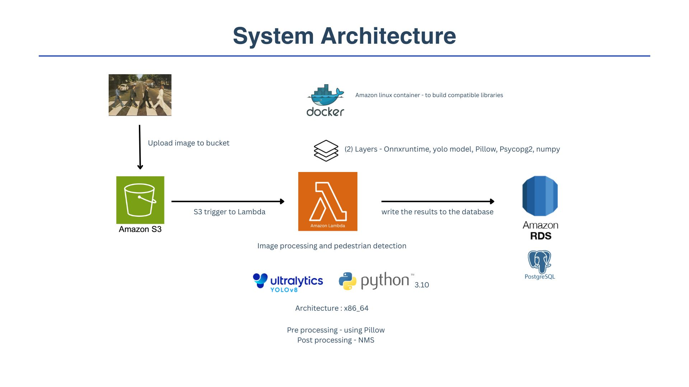

# Vehicle Safety Detection Pipeline with AWS Lambda

This repository contains the implementation of a vehicle safety detection pipeline using AWS services to detect pedestrians in vehicle camera images, process them with a computer vision model, and store results in a database. This project was developed as part of my preparation for a internship interview, aligning with the role's focus on data science, AI, computer vision, and cloud optimization.

## Project Overview

- **Purpose**: Detect pedestrians in images to identify critical road safety situations, contributing to the evaluation and optimization of vehicle safety systems.
- **Goal**: Demonstrate skills in cloud engineering, computer vision, database design, and Python programming by building an end-to-end pipeline.
- **Architecture**: S3 → AWS Lambda Layer → RDS (PostgreSQL).

## System Architecture

- **Amazon S3**: Stores uploaded vehicle camera images, triggering the pipeline.
- **AWS Lambda Layer**: 
  - Processes images using a YOLOv8 ONNX model pre-trained on COCO for pedestrian detection.
  - Custom layer includes dependencies: `onnxruntime`, `Pillow`, `psycopg2`, and `numpy`.
  - Pre-processing with `Pillow` (e.g., resizing to 640x640).
  - Post-processing with Non-Max Suppression (NMS) to avoid duplicate pedestrian counts.
- **Amazon RDS (PostgreSQL)**: Stores detection results in the `vehicle_safety_data` table (image key, timestamp, location, speed, classification, pedestrians detected).
- **Hardware**: Optimized for x86_64 architecture to match AWS Lambda.

## Challenges and Solutions

### 1. Lambda Layer Size Constraint (250 MB Limit)
- **Challenge**: The 250 MB limit for Lambda layers made it difficult to include all libraries (`onnxruntime`, `Pillow`, `psycopg2`, `numpy`) and the 5.47 MB YOLOv8 model.
- **Solution**: 
  - Optimized imports by using minimal versions (e.g., `onnxruntime==1.16.3`, `Pillow==9.5.0`) with `--no-deps`.
  - Chose `Pillow` over OpenCV for lighter image processing.
  - Used Docker to build a compact layer on Amazon Linux 2, removing `.dist-info` and `.egg-info` directories.

### 2. Building Compatible Libraries for Lambda
- **Challenge**: Building dependencies for Lambda’s Amazon Linux environment from an ARM-based Python 3.12 setup was incompatible.
- **Solution**: Utilized Docker containers with Amazon Linux 2 to compile and package dependencies (`pip install --platform manylinux2014_x86_64`), ensuring compatibility with Lambda’s runtime.

### 3. Model Selection Under Constraints
- **Challenge**: Needed a model that fits within the 250 MB limit while providing accurate pedestrian detection.
- **Solution**: Selected YOLOv8n (lightweight variant) in ONNX format, optimized with float32 inputs to reduce memory usage, fitting the 5.47 MB model into the layer.

### 4. Enabling Communication Between AWS Services
- **Challenge**: Setting up secure communication between S3, Lambda, and RDS required proper permissions and VPC configuration.
- **Solution**: 
  - Configured IAM policies with `s3:GetObject`, `s3:ListBucket`, and EC2 actions (`CreateNetworkInterface`, etc.) using specific ARNs (e.g., `arn:aws:s3:::vehicle-safety-bucket/*`).
  - Set up VPC with subnets and security groups for RDS access, resolving permission errors.

### 5. Avoiding Duplicate Pedestrian Counts
- **Challenge**: The YOLOv8 output (shape `(1, 84, 8400)`) produced overlapping detections, leading to inaccurate pedestrian counts.
- **Solution**: Implemented Non-Max Suppression (NMS) post-processing, converting center-format coordinates (`x, y, w, h`) to corner format (`x1, y1, x2, y2`) for filtering with an IoU threshold.

## Future Enhancements

- **SQS Integration**: Add an SQS queue as a Lambda destination for result buffering.
- **Real-Time Streaming**: Replace S3 with Amazon Kinesis for live data processing.
- **ETL Automation**: Use AWS Step Functions to orchestrate the pipeline.
- **Optimization**: Collaborate with cloud teams to further reduce latency.

## License

[MIT License] 

---
